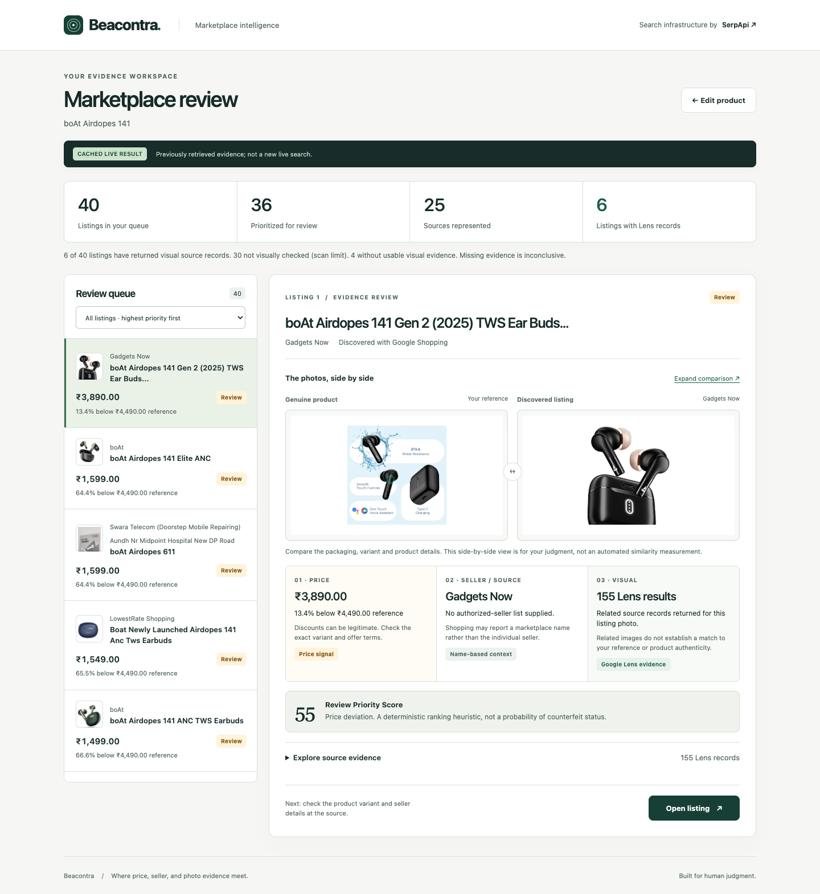

# Beacontra — Commerce & Market Intelligence

> **Where price, seller, and photo evidence meet.** *(tagline — see `docs/TAGLINE.md`; pending Gemini's red-team of 5 candidates, may still change before final submission)*
> Built for the SerpApi India Hackathon 2026.


**One queue. Three evidence trails. Your judgment.** Add a product name and genuine product photo link, scan marketplaces, then review the highest-priority listing with its price, source and visual records together.

*Hero: an illustrative workflow, not simulated search results. Review screenshots below replay `docs/FINAL_METRICS_DUMP.json`, explicitly labelled **CACHED LIVE RESULT**. These are recorded results, not a new live search or proof of authenticity; product variants still require human review.*

[Reference input](docs/screenshots/reference-input.png) · [Scan experience](docs/screenshots/loading.png) · [Review queue](docs/screenshots/review-queue.png) · [Expanded comparison](docs/screenshots/evidence-detail.png) · [Mobile workspace](docs/screenshots/mobile-review.png)

<details>
<summary>See the evidence workspace</summary>



</details>

Beacontra helps Indian direct-to-consumer (D2C) brands monitor marketplace listings across Flipkart, Amazon.in, and the open web. It cross-references live marketplace listings (`google_shopping`), performs reverse-image verification via Google Lens (`google_lens`), and evaluates seller metadata to identify listings worth review, unauthorized distributors, and commercial anomalies.

**Note on the name:** formerly developed under the internal codename "BrandLens," which collided with existing products (`docs/NAMING_DECISION.md`). Renamed to Beacontra after two independent collision audits found it clean (`docs/NAMING_V2.md`, `docs/NAMING_AUDIT_V2.md`).

## The problem

Counterfeit and unauthorized-seller listings on Indian e-commerce marketplaces are pervasive and effectively unmonitorable by hand. This isn't a hypothetical: Delhi High Court restricted Flipkart's "latching-on" feature in November 2024 specifically because it let third-party sellers list counterfeit goods directly under a genuine brand's product page; BIS raided Amazon and Flipkart warehouses in March 2025 over forged certification marks; Meesho disclosed removing 4.2 million counterfeit listings in six months. Small Indian D2C/SME brands — big enough to be worth counterfeiting, too small to afford enterprise brand-protection SaaS — have no affordable way to check this for their own products, today. Full evidence trail: `docs/DECISION.md`, `docs/RESEARCH.md` §6.

## The insight

Every existing tool in this space (including the closest thing to a direct competitor we found, a domain-typosquatting scanner called CeaseFire — see Differentiation below) checks whether a brand is being *mentioned* or *impersonated*. None of them check whether a specific marketplace listing's *photo* actually depicts the *genuine product*. A reverse-image match is comparatively hard to fake and cheap to check via `google_lens` — and combined with price and seller signals, it turns three individually weak, noisy signals into one ranked, evidence-backed list a brand owner can actually act on.

## Differentiation

The closest prior art found (via a direct fetch of its own README/architecture, not just a one-line gallery description) is **CeaseFire**, a domain-typosquatting/phishing-defense scanner: input is a brand *domain*, it generates ~126 lookalike-domain candidates, DNS-prefilters them, and ends in a signed takedown notice. It has no product-listing search, no price/seller signals, and — per an independent, deeper inspection of its cloned source — no confirmed `google_lens` usage. This project's input is a product name *and photo*; its output is a ranked *listing* review queue, not a domain takedown notice. Full forensic comparison, including tests we ran specifically to falsify our own differentiation claim rather than assume it: `docs/COMPETITIVE_ADJUDICATION.md`.

---

## SerpApi Setup

### 1. Configure Environment Variables

Create a local `.env` file from the example template:

```bash
cp .env.example .env
```

Add your SerpApi API key:

```env
SERPAPI_API_KEY=your_key_here
```

> [!IMPORTANT]
> - **Never commit `.env`**: `.env` and `.dev.vars` are gitignored to ensure API keys are never checked into version control.
> - **Server-side only**: The SerpApi API key is strictly accessed in server-side worker bindings or backend Node runtime. It is never bundled into or accessible by client-side browser JavaScript.
> - **Backwards compatibility**: Both `SERPAPI_API_KEY` and legacy `SERPAPI_KEY` are supported through the centralized config layer (`src/lib/config.ts`).

### 2. Install Dependencies

```bash
npm install
```

### 3. Run Development Server

Start the Cloudflare Workers development server:

```bash
npm run dev
```

Visit `http://localhost:8787` in your browser to access the interactive Beacontra UI.

### 4. Running Tests

#### Unit Tests (Zero Live Credits)
Standard unit tests run entirely against local fixture data and **never** consume live SerpApi credits:

```bash
npm test
```

#### Controlled Live Smoke Test (Opt-in)
To verify your real SerpApi key with a single, controlled query that validates authentication, schema parsing, and entity normalization:

```bash
npm run serpapi:smoke
```

Or via Vitest:

```bash
npm run test:live
```

---

## Architecture & Credit Budget

- **Backend Runtime**: Cloudflare Workers (Hono framework) with TypeScript.
- **Engines & Request Breakdown**:
  - **TOTAL API REQUESTS**: 11 engine search calls (+ up to 10 image-upload attempts per scan)
  - **SHOPPING REQUESTS**: 1 call per scan (`google_shopping`) to discover marketplace listings.
  - **LENS REQUESTS**: 10 calls per scan (`google_lens`) evaluated on the top candidate thumbnails.
  - **IMAGE-UPLOAD REQUESTS**: up to 10 pre-search uploads to generate `image_id` for Lens exact matching.
  - **ESTIMATED CREDIT COST**: 13–33 credits (internal app-level heuristic estimate; not confirmed SerpApi billing).
- **Candidate Cap & Visual Coverage**: Beacontra performs Lens analysis on the top 10 candidate listings to bound API usage; the remaining listings retain commercial price/source evidence.
- **Signal Fusion**: Deterministic weighting of Price Anomaly, Seller Anomaly, and Visual Signal into a 0-100 **Review Priority Score** (verified against the current UI label — not a statistical confidence figure, a review-ranking heuristic).
- **Frontend**: Dependency-free vanilla JavaScript and local CSS, served through Workers Static Assets. Ranked queue, side-by-side evidence workspace, accessible expanded comparison, image-link preview, and an example-product shortcut.

---

## Why SerpApi is essential (not decorative)

Every fact this product surfaces — which listings exist, at what price, from which seller, whether the photo matches — comes from a live SerpApi call. There is no persisted "known good/bad" database standing in for it. The visual-verification signal specifically requires a reverse-image search engine; there is no way to build "does this photo match" without one. Remove SerpApi and there is nothing left to show. Full argument, stress-tested against a hostile-judge question set: `docs/JUDGE_QA.md`.

## AI development disclosure

This project was built primarily by three AI coding agents working under human direction and coordinating through shared markdown files (`docs/AI_COORDINATION.md`, `docs/TASK_BOARD.md`), not a single agent working alone: **Claude Code** (research, product selection, architecture docs, competitive adjudication, code review, submission copy), **OpenCode** (scaffolding, core implementation, live-integration work), **Gemini CLI** (adversarial red-teaming, UX/demo audits, an independent competitive adjudication, some implementation fixes). The human configured the live SerpApi credentials and made or approved decisions at checkpoints. AI-generated code was verified via automated tests/typecheck/lint/build gates plus cross-agent review that found and fixed real bugs (a seller-signal logic error, an uncapped credit-cost loop, missing live-vs-fixture UI transparency) — not accepted on a single unchecked pass. Full disclosure with specifics: `docs/JUDGE_QA.md` Q17-19, `docs/SUBMISSION.md`.

## Known limitations

Stated plainly rather than glossed over:
- Scoring weights (price/seller/visual signal contributions) are hand-chosen heuristics, not statistically calibrated against a labeled dataset — none exists to calibrate against. This is positioned as decision-support, not a certainty score.
- No real brand owner has used this yet — usefulness is evidenced by a documented market gap (two independently-run research passes reaching the same conclusion), not validated customer demand.
- Absence of evidence is handled conservatively: Lens returning zero matches is classified as neutral `no_evidence`, not penalized as an automatic counterfeit accusation.
- No takedown-drafting or enforcement step exists — the output is a review queue for a human, not an end-to-end enforcement workflow.

## Project structure

```
src/
  index.ts              Hono app, API routes (/api/search, /api/beacontra/scan)
  lib/
    beacontra.ts         Core service: listing extraction, signal analysis, fusion/scoring
    serpapi-client.ts     Generic SerpApi client: caching, retry, fixtures, credit tracking
    config.ts              Centralized env/config resolution (SERPAPI_API_KEY / SERPAPI_KEY)
    cache.ts                Tiered KV + in-memory cache
    types.ts                 Zod schemas per SerpApi engine
    fixtures/                 Per-engine JSON fixtures for zero-credit testing
public/
  index.html             Product input and evidence workspace
  app.js                 Scan interaction, provenance, evidence rendering
  styles.css             Responsive design system (no runtime CSS framework)
tests/                  Unit tests (fixture-based) + gated live-integration tests
scripts/
  serpapi-smoke.ts        Opt-in live-key verification script
docs/                   Full research, decision, architecture, and process trail (see below)
```

Full research/decision trail, in reading order: `docs/RESEARCH.md` → `docs/COMPETITIVE_LANDSCAPE.md` → `docs/DECISION.md` → `docs/COMPETITIVE_ADJUDICATION.md` → `docs/PRODUCT_SPEC.md` → `docs/ARCHITECTURE.md` → `docs/SERPAPI_BUDGET.md` → `docs/DEMO.md` → `docs/SUBMISSION.md`. Process/coordination: `docs/AI_COORDINATION.md`, `docs/TASK_BOARD.md`, `docs/DECISIONS_LOG.md`.

### Browser verification and screenshots

With `npm run dev` running in another terminal:

```bash
npx playwright install chromium
npm run test:ui
```

This checks the actual served UI at six widths, runs axe accessibility checks, exercises error recovery, missing evidence, validation, keyboard focus and unsafe source data, and captures screenshots under `docs/screenshots/`. Every scan API request is intercepted: **zero live SerpApi credits**. Result screenshots replay the checked-in response with explicit cached provenance. `CHROMIUM_EXECUTABLE_PATH` can select an existing Chromium installation. Full results and remaining backend-dependent UX limitations: [Astra verification](docs/ASTRA_UI_VERIFICATION.md).

`npm run test:ui:performance` measures local initial rendering, layout shifts, frame cadence, asset sizes and reduced-motion/enhancement fallbacks. The signature hero uses CSS perspective rather than a WebGL dependency. [Visual rebuild QA and measurements](docs/ASTRA_VISUAL_QA.md).

## License

Not yet specified — an open-source license is encouraged but not required by the hackathon rules. Add one before final submission if intending to open-source beyond the hackathon.

---

## Production Deployment (Cloudflare Workers)

To configure production secrets in Cloudflare Workers without committing credentials:

```bash
npx wrangler secret put SERPAPI_API_KEY
```

Then deploy:

```bash
npm run deploy
```
