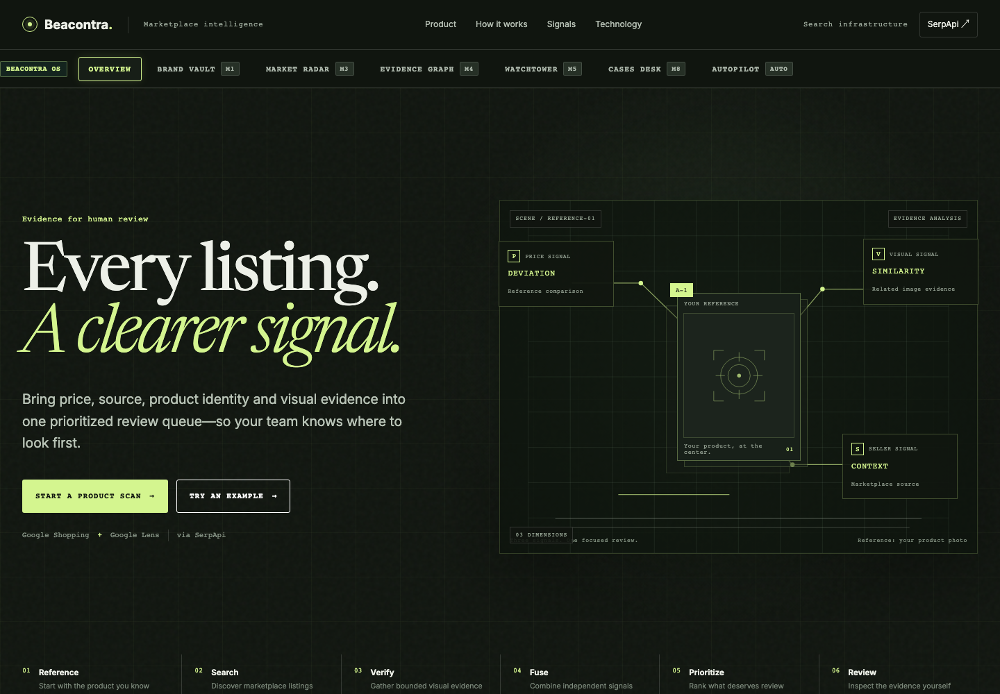

# Beacontra

**Evidence-first marketplace intelligence for Indian brands.**

Beacontra helps D2C and SME brand protection teams investigate marketplace listings across Flipkart, Amazon.in, and Google Shopping using live market and visual-search evidence.



```
Brand Vault  ───►  Market Radar  ───►  Visual Forensics  ───►  Evidence Graph  ───►  Watchtower  ───►  Evidence Desk Dossier
 (Ground Truth)     (Shopping Search)     (Google Lens)        (Relational View)      (Change Over Time)     (Standalone HTML)
```

[Reference input](docs/screenshots/reference-input.png) · [Scan experience](docs/screenshots/loading.png) · [Review queue](docs/screenshots/review-queue.png) · [Expanded comparison](docs/screenshots/evidence-detail.png) · [Mobile workspace](docs/screenshots/mobile-review.png)

---

## Problem

Counterfeit and unauthorized marketplace listings on Indian e-commerce platforms are pervasive and overwhelming to track manually.

- **Regulatory & Marketplace Reality**: In November 2024, the Delhi High Court restricted Flipkart's "latching-on" feature because third-party sellers were latching counterfeit items directly onto legitimate brand listings. In March 2025, the Bureau of Indian Standards (BIS) raided fulfillment centers over forged certification marks. Meesho disclosed removing 4.2 million non-compliant listings in six months.
- **The D2C Dilemma**: Fast-growing Indian D2C and SME brands are large enough to be targeted by unauthorized sellers, distributors violating territorial agreements, and gray-market importers, but too small to afford enterprise brand-protection platforms costing $25k+/year.
- **Signal Overload**: Brand protection managers cannot manually comb through hundreds of listings daily. They need a prioritized, evidence-backed workspace that clusters pricing anomalies, seller authorization gaps, and visual mismatches into actionable investigation files.

---

## What Beacontra Does

Beacontra replaces scattered manual screenshots and guesswork with an evidence-backed intelligence workspace:

1. **Brand Vault**: Stores ground-truth product DNA, statutory Maximum Retail Price (MRP), expected street-price bands, authorized seller domains, and canonical reference photography.
2. **Market Radar**: Discovers live marketplace offers across Indian e-commerce channels using SerpApi Google Shopping, isolating candidate listings while filtering variant noise (e.g., cases, chargers, Pro tiers, generation mismatches).
3. **Visual Forensics**: Dispatches candidate listing thumbnails to SerpApi Google Lens for reverse-image cross-referencing against brand sources and visual matching databases.
4. **Evidence Graph**: Renders an interactive bipartite graph linking brands, products, listings, sellers, and visual evidence nodes to expose multi-listing seller clusters.
5. **Watchtower**: Tracks historical pricing and merchant snapshots over time, detecting stealth price drops, new unauthorized merchants, and product image replacements.
6. **Evidence Desk**: Collects flagged findings into case dockets with analyst notes, audit trails, and one-click export to print-ready standalone HTML dossiers.
7. **Beacontra Lens (Chrome Extension)**: Manifest V3 browser companion that extracts listing metadata directly from Amazon.in and Flipkart, links to Brand DNA, and fires investigations into Beacontra OS with zero client-side credentials.

---

## Signature Workflow

Here is how an investigator uses Beacontra end-to-end:

1. **Select Reference Profile**: Open Brand Vault and select a registered product (e.g., *boAt Airdopes 141* with MRP ₹4,490, authorized street band ₹1,000–₹1,500, authorized seller list).
2. **Execute Market Radar Scan**: Radar queries Google Shopping (`gl: "in"`, `hl: "en"`). It normalizes titles, isolates exact model matches, and flags price anomalies (e.g., deep discounts < ₹1,000 or inflated resale).
3. **Inspect Visual Evidence**: Reverse-image matching via Google Lens tests listing thumbnails against known brand domains. If Lens returns no structured matches, the system conservatively reports neutral `no_evidence` rather than fabricating an anomaly.
4. **Examine the Evidence Graph**: Open the Evidence Graph to see which sellers are cross-listed across multiple platforms and whether they cluster around specific pricing tiers.
5. **Explain This Finding**: In the inspector, click "Explain This Finding" to view heuristic rule explanations, counterfactual scenarios ("What if this seller were authorized?"), and recommended playbooks (e.g., Notice & Takedown, Test Purchase).
6. **File Case & Export Dossier**: File the finding into Evidence Desk, record notes, and download a standalone HTML investigation report with full provenance and legal disclaimers.

---

## Why SerpApi Matters

Beacontra is built entirely around live search and visual evidence provided by SerpApi. Removing SerpApi would eliminate the foundation of the product:

| SerpApi Engine | Role in Beacontra | Why It Is Essential |
|---|---|---|
| `google_shopping` | Marketplace Listing Discovery | Provides live Indian marketplace listings across Amazon.in, Flipkart, Reliance Digital, Croma, Myntra, JioMart, etc., with real-time offer prices, merchant names, ratings, and listing thumbnails. |
| `google_lens` | Reverse-Image Verification | Analyzes listing thumbnails to find source image origins, visual match clusters, and whether an unauthorized seller is reusing official brand press photos or altered imagery. |
| `image_upload` / Image API | Image Tokenization | Used to upload local reference product images or listing crops to obtain an `image_id` for exact visual lookup. |

Without SerpApi, Beacontra would have no access to live market prices, no multi-platform seller discovery, and no visual search capability.

---

## Architecture

```
┌─────────────────────────────────────────────────────────────────────────────┐
│                       CLIENT TIER (Zero Secrets)                            │
│  ┌─────────────────────────┐              ┌──────────────────────────────┐  │
│  │   Beacontra OS UI       │              │  Beacontra Lens Extension    │  │
│  │   (Vanilla JS / CSS)    │              │  (Chrome MV3 Sidepanel)      │  │
│  └────────────┬────────────┘              └──────────────┬───────────────┘  │
└───────────────┼──────────────────────────────────────────┼──────────────────┘
                │ HTTP API                                 │ HTTP API
                ▼                                          ▼
┌─────────────────────────────────────────────────────────────────────────────┐
│                    SERVERLESS APPLICATION TIER                              │
│              Cloudflare Workers (Hono Router / TypeScript)                  │
│                                                                             │
│  ┌─────────────────────┐  ┌─────────────────────┐  ┌─────────────────────┐  │
│  │   Security Gateway  │  │   Brand DNA Vault   │  │   Market Radar      │  │
│  │   - SSRF Protection │  │   - SKU Normalizer  │  │   - Price Baselines │  │
│  │   - Rate Limiter    │  │   - Ground Truth    │  │   - Variant Filter  │  │
│  └──────────┬──────────┘  └──────────┬──────────┘  └──────────┬──────────┘  │
│             │                        │                        │             │
│  ┌──────────▼──────────┐  ┌──────────▼──────────┐  ┌──────────▼──────────┐  │
│  │  Visual Forensics   │  │   Evidence Graph    │  │   Evidence Desk     │  │
│  │  - Lens Matching    │  │   - Relational Core │  │   - Case Docket     │  │
│  │  - Crop Heuristics  │  │   - Bipartite Graph │  │   - Standalone HTML │  │
│  └─────────────────────┘  └─────────────────────┘  └─────────────────────┘  │
└──────────────────────────────────────┬──────────────────────────────────────┘
                                       │
                        Server-Side Credentials Only
                                       ▼
┌─────────────────────────────────────────────────────────────────────────────┐
│                          EXTERNAL EVIDENCE PROVIDER                         │
│                                SerpApi                                      │
│         [google_shopping]       [google_lens]       [image_upload]          │
└─────────────────────────────────────────────────────────────────────────────┘
```

---

## Features

- **Brand Vault (Brand DNA)**: Central repository for brand identity, canonical photos, statutory MRP, and approved sellers list.
- **Market Radar**: Marketplace cross-search with automated variant disambiguation (separates accessories, bundles, and model generations).
- **Visual Forensics**: Reverse-image inspection powered by SerpApi Google Lens, classifying visual matches into confirmed, unverified, or neutral evidence.
- **Evidence Graph**: Interactive SVG network graph displaying relationships between brands, products, listings, sellers, and visual evidence.
- **Watchtower**: Temporal snapshot comparison tracking merchant price changes, new sellers, and listing alterations over time.
- **Evidence Desk**: Case management docket with priority triage, analyst notes, and print-ready HTML dossier exports.
- **Investigation Intelligence & Action Center**: Transparent finding explainability, counterfactual simulations, and structured triage playbooks.
- **Investigation Autopilot**: Deterministic multi-step investigation planner with strict credit budget caps and replay scrubber.
- **Beacontra Lens Chrome Extension**: Sidepanel tool for in-situ listing analysis on Amazon.in and Flipkart.

---

## Quick Start

### 1. Prerequisites
- Node.js 18+ (tested with Node 20 and Node 22)
- npm

### 2. Installation
```bash
git clone https://github.com/ThatKJ/Beacontra.git
cd Beacontra
npm install
```

### 3. Configure Environment
Copy the example environment template:
```bash
cp .env.example .env
```

Open `.env` and provide your SerpApi API key:
```env
SERPAPI_API_KEY=your_serpapi_key_here
```

> **Security Note**: The API key is stored server-side only in `.env` (gitignored) or as a Cloudflare Worker secret. It is never exposed in client bundles or network responses.

### 4. Run Development Server
```bash
npm run dev
```
Open **`http://localhost:8787`** in your browser.

---

## Testing & Quality Gates

All core test suites run against local fixtures with **zero live SerpApi credits consumed**:

```bash
# 1. Run full unit and regression test suite
npm test

# 2. Verify TypeScript type safety
npm run typecheck

# 3. Verify code style and linting
npm run lint

# 4. Verify Cloudflare Worker production build bundle
npm run build

# 5. Run headless browser UI, accessibility (axe), and multi-viewport tests
npm run test:ui

# 6. Run local rendering performance and core metrics check
npm run test:ui:performance
```

### Current Verified Test Baseline
- **Vitest Test Suite**: 17 test files passed (100%), 158 tests passed, 1 skipped (live-key gated).
- **TypeScript**: 0 type errors (`tsc --noEmit`).
- **ESLint**: Clean pass.
- **Wrangler Build**: 284 KiB worker bundle compiled successfully (`wrangler deploy --dry-run`).
- **UI Test Suite**: 6 viewports verified (375px, 390px, 430px, 768px, 1024px, 1440px), 0 axe WCAG violations.
- **Performance**: Desktop LCP ~700ms, Mobile LCP ~616ms, CLS 0–0.01.

---

## Chrome Extension Setup

The Beacontra Lens Chrome companion is located in `extension/`:

1. Open Google Chrome and navigate to `chrome://extensions/`.
2. Enable **Developer mode** in the top-right corner.
3. Click **Load unpacked**.
4. Select the `extension/` directory inside this repository.
5. Browse any product page on `amazon.in` or `flipkart.com` and click the Beacontra Lens icon in the toolbar to open the investigation side panel.

---

## Evidence Philosophy

> **Critical Notice**: Beacontra produces commercial investigation signals and structured evidence for human review. It does **not** determine whether a product is legally counterfeit.

Listing titles, seller names, prices, and photo matches are clues assembled into a prioritized docket. Final commercial or legal actions (such as sending formal notice, test-purchasing, or platform complaints) remain the sole responsibility of human brand managers and legal counsel.

---

## Limitations

- **Heuristic Scoring**: Risk scores (0–100) are decision-support heuristics designed to order review priority, not statistical guarantees.
- **Thumbnail Quality**: Reverse-image lookup depends on the resolution of marketplace thumbnails provided by search engines.
- **Marketplace Coverage**: Coverage reflects listings indexed by Google Shopping at the time of the query.
- **Absence of Evidence**: When Google Lens returns zero matches, Beacontra classifies the result as neutral `no_evidence` rather than treating it as positive evidence of fraud.

---

## Existing Project Disclosure

An initial concept named "BrandLens" was started prior to the hackathon. During this hackathon cycle, the project was completely overhauled and evolved into **Beacontra OS**:
- Replaced the initial concept with the multi-module Beacontra OS architecture (Brand Vault, Market Radar, Visual Forensics, Evidence Graph, Watchtower, Evidence Desk, Autopilot).
- Built the Manifest V3 Chrome extension (`extension/`) from scratch.
- Implemented comprehensive SSRF defense with IPv4/IPv6 private IP blocklists and redirect safety.
- Built deterministic SKU normalization and variant filtering to eliminate false positives.
- Implemented standalone HTML dossier export (`generateInvestigationHtmlReport`).
- Created a comprehensive test suite (17 test files, 158 tests) and automated browser verification.

---

## AI Disclosure

This project was developed collaboratively with AI coding assistants under human direction:
- **Claude / Claude Code**: Architecture design, adversarial challenge review, documentation.
- **Gemini**: Independent red-team analysis, security audits, competitive landscape verification.
- **GPT-6 Astra**: Visual design system tokens, responsive layout engineering, accessibility.
- **OpenCode**: Backend service implementation, TypeScript typing, test harness creation.

All generated code underwent automated testing, linting, build checks, and human verification before inclusion.

---

## License

MIT License. See [LICENSE](LICENSE) for details.
